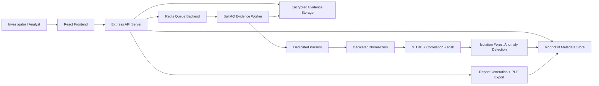
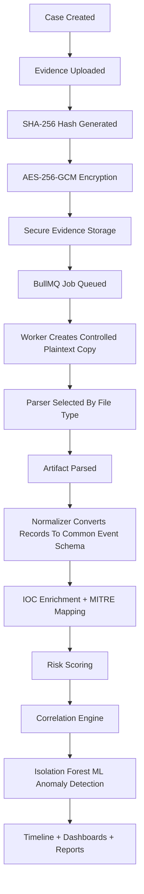

# Automated Digital Forensics Reporting Tool - Current System Design

## 1. System Purpose

The Automated Digital Forensics Reporting Tool is a full-stack forensic investigation platform. Its purpose is to help investigators create cases, upload raw evidence, preserve file integrity, parse forensic artifacts, normalize extracted events, detect attack behavior, reconstruct timelines, run anomaly detection, and generate investigation reports.

The current system is designed so expensive AI usage is limited to report writing and case-chat style assistance. Core forensic work such as parsing, hashing, normalization, MITRE mapping, risk scoring, timeline construction, and anomaly detection is handled through deterministic code and Python-based parsers.

## 2. High-Level Architecture

## 3. Main Runtime Components

### 3.1 Frontend

The frontend is a React/Vite application. It provides the user-facing interface for:

- Login and authentication.
- Dashboard overview.
- Case management.
- Evidence upload.
- Timeline reconstruction.
- MITRE ATT&CK visualization.
- IOC/threat indicator viewing.
- Anomaly dashboard.
- Case chat.
- Report generation, review, and export.
- Settings and security configuration.

Important frontend files:

- `client/src/App.jsx`
- `client/src/api.js`
- `client/src/pages/EvidenceUpload.jsx`
- `client/src/pages/Timeline.jsx`
- `client/src/pages/MitreAttack.jsx`
- `client/src/pages/ThreatIocs.jsx`
- `client/src/pages/AnomalyDashboard.jsx`
- `client/src/pages/Reports.jsx`
- `client/src/pages/ReportDetail.jsx`
- `client/src/pages/CaseDetail.jsx`

### 3.2 Backend API Server

The backend is an Express.js server. It exposes APIs for authentication, cases, evidence, parsing, jobs, timelines, anomalies, reports, settings, audit logs, and dashboard data.

Important backend routes:

- `server/routes/auth.js`
- `server/routes/cases.js`
- `server/routes/evidence.js`
- `server/routes/parse.js`
- `server/routes/jobs.js`
- `server/routes/timeline.js`
- `server/routes/anomalies.js`
- `server/routes/reports.js`
- `server/routes/dashboard.js`
- `server/routes/settings.js`
- `server/routes/audit.js`

### 3.3 Background Worker

Evidence processing runs through BullMQ and Redis. This prevents heavy parsing, encryption, hashing, and ML work from blocking the API request thread.

Important files:

- `server/jobs/queues.js`
- `server/jobs/enqueue.js`
- `server/jobs/evidenceProcessor.js`
- `server/jobs/processingJobTracker.js`
- `server/workers/evidenceWorker.js`
- `server/JOB_PIPELINE.md`

### 3.4 MongoDB

MongoDB stores investigation metadata, not raw evidence bytes.

MongoDB stores:

- User records.
- Case records.
- Evidence metadata.
- SHA-256 hashes.
- Encryption metadata.
- Parser summaries.
- Normalized event JSON.
- ML anomaly summaries.
- Processing job states.
- Report records.
- Audit logs.

Important models:

- `server/models/User.js`
- `server/models/Case.js`
- `server/models/Evidence.js`
- `server/models/ProcessingJob.js`
- `server/models/Report.js`
- `server/models/AuditLog.js`

### 3.5 Encrypted Evidence Store

Actual evidence files are stored outside MongoDB in a filesystem evidence store. The raw file is encrypted using AES-256-GCM before being stored.

Important correction: the current implementation is **not envelope/KMS encryption**. It uses AES-256-GCM with a configured `EVIDENCE_ENCRYPTION_KEY`. In development, the code can fall back to a key derived from `JWT_SECRET` or a development key. It does not currently generate a unique data encryption key per evidence file and then wrap that key with a KMS/master key.

MongoDB keeps only references and metadata, including:

- Storage path.
- Encryption algorithm.
- Key ID.
- IV/nonce.
- Authentication tag.
- Original SHA-256 hash.

Important file:

- `server/utils/fileSecurity.js`

### 3.6 Parser and Normalizer Layer

The parser phase is intentionally separated by artifact type. This avoids pushing raw forensic data into an LLM and reduces cost.

Dedicated parser files:

- `server/parsers/systemLogParser.js`
- `server/parsers/csvParser.js`
- `server/parsers/jsonParser.js`
- `server/parsers/metadataParser.js`
- `server/parsers/registryParser.js`
- `server/parsers/pythonArtifactParser.js`
- `server/python_parsers/parse_artifact.py`

Dedicated normalizer files:

- `server/normalizers/systemLogNormalizer.js`
- `server/normalizers/csvNormalizer.js`
- `server/normalizers/jsonNormalizer.js`
- `server/normalizers/metadataNormalizer.js`
- `server/normalizers/registryNormalizer.js`
- `server/normalizers/pcapNormalizer.js`
- `server/normalizers/evtxNormalizer.js`

Supported parser inputs in the current implementation:

- `.log`
- `.txt`
- `.csv`
- `.json`
- `.reg`
- `.pcap`
- `.evtx`

## 4. Evidence Processing Workflow

## 5. Common Normalized Event Schema

After parsing, all artifact types are converted into a common event structure. This makes timeline construction and detection logic work across multiple file types.

Common event fields include:

- `timestamp`
- `sourceType`
- `source`
- `host`
- `user`
- `sourceIp`
- `destinationIp`
- `eventType`
- `severity`
- `detail`
- `raw`
- `mitreAttack`
- `threatIntel`
- `riskScore`
- `riskLevel`
- `riskReasons`
- `mlAnomaly`

## 6. Detection Design

The detection layer has three parts.

### 6.1 MITRE ATT&CK Mapping

Parsed event text is matched to MITRE ATT&CK techniques. This helps translate raw events into attacker behavior.

Important file:

- `server/utils/attackMapper.js`

### 6.2 Risk Scoring

Each event receives a numeric risk score and risk level based on severity, event type, IOC reputation, MITRE mapping, and suspicious behavior.

Important file:

- `server/analysis/riskScoring.js`

### 6.3 Correlation Engine

The system detects higher-level attack patterns by correlating multiple normalized events.

Current examples include:

- Brute force followed by successful login.
- Suspicious shell or PowerShell after login.
- Privilege escalation after authentication.
- Data transfer after script execution.

Important file:

- `server/analysis/correlationEngine.js`

Important correction: this is timeline construction plus deterministic correlation alerts. The system sorts normalized events by timestamp and detects known patterns. It does not fully infer attacker intent, attacker objective, or final intrusion goal on its own.

## 7. ML Anomaly Detection Design

The anomaly detection module uses Isolation Forest through Python/scikit-learn.

Important correction: the current ML model compares events within the current event set. It does not yet compare against a stored 1-day, 1-week, or long-term historical baseline of normal activity.

The ML system looks at features such as:

- Time of event.
- Event type.
- Severity.
- Risk score.
- Threat intelligence score.
- MITRE mapping presence.
- User/source/host indicators.
- Suspicious terms such as PowerShell, curl, wget, privilege escalation, failed login, malware, and transfer activity.

Important files:

- `server/ml/anomaly_detector.py`
- `server/ml/anomalyDetector.js`
- `server/routes/anomalies.js`
- `client/src/pages/AnomalyDashboard.jsx`

## 8. Reporting Design

Reports combine deterministic forensic outputs with optional AI-generated writing support.

Report sections currently include:

- Executive Summary.
- Evidence Inventory.
- Timeline.
- Key Findings.
- Correlated Attack Alerts.
- ML Anomaly Detection.
- Threat Indicators.
- MITRE ATT&CK.
- Recommendations.

The report export process generates PDF output and stores export metadata, including the generated file hash.

Important correction: backend report export supports final PDF hashing and export metadata, but the current report detail frontend can still export through a browser print window. That frontend path can bypass the backend export route unless the UI is wired to call `/api/reports/:id/export`.

Legal and corporate report samples exist for reference, and report prompts use neutral forensic wording. However, the current app does not yet expose selectable "legal" versus "corporate" report profiles or separate rulesets in the UI. Reports use a fixed section structure.

Important files:

- `server/routes/reports.js`
- `server/models/Report.js`
- `client/src/pages/Reports.jsx`
- `client/src/pages/ReportDetail.jsx`

## 9. API and AI Usage Boundary

The system avoids using AI for core parser work.

Code-based processing:

- File hashing.
- Evidence encryption.
- `.evtx` parsing.
- `.pcap` parsing.
- System log parsing.
- Registry parsing.
- Metadata parsing.
- Normalization.
- Timeline reconstruction.
- MITRE mapping.
- Correlation alerts.
- Risk scoring.
- Isolation Forest anomaly detection.

AI-assisted processing:

- Report drafting.
- Executive summary writing.
- Recommendation wording.
- Case-chat assistance.

This boundary keeps the system cheaper, more auditable, and more suitable for forensic work.

Important correction: AI is not used for core forensic detection. Parsing, timeline building, MITRE mapping, risk scoring, correlation, and ML anomaly detection are code-based. AI is used mainly for drafting summaries, findings, recommendations, and case-chat responses.

## 10. Deployment Design

The project now supports Docker-based deployment.

Runtime services:

- `client`: React frontend served by nginx.
- `server`: Express API server.
- `evidence-worker`: BullMQ worker for background evidence processing.
- `mongo`: MongoDB database.
- `redis`: Redis queue backend.

Deployment files:

- `Dockerfile.server`
- `Dockerfile.client`
- `docker-compose.yml`
- `deploy/nginx.conf`
- `.dockerignore`
- `DEPLOYMENT.md`

## 11. CI Design

The GitLab CI pipeline validates the project in stages:

1. Backend JavaScript and Python syntax validation.
2. Parser phase smoke test against a live API with MongoDB and Redis services.
3. Frontend production build.
4. Docker image packaging.

Important file:

- `.gitlab-ci.yml`

## 12. Security Design

Security features currently implemented:

- SHA-256 hash generation for evidence integrity.
- AES-256-GCM encryption for stored evidence files.
- Configured-key encryption, not true envelope/KMS encryption.
- Evidence metadata stored separately from encrypted evidence bytes.
- Controlled temporary plaintext extraction only during parsing.
- Cleanup of temporary parser files.
- JWT-based authentication.
- Audit logging for important investigation actions.
- Evidence verification support.
- Environment-based secrets for encryption, JWT, Redis, MongoDB, and optional threat intelligence APIs.

## 13. Current System Summary

The current system is an end-to-end forensic reporting pipeline:

Case Management -> Evidence Upload -> Hashing -> Secure Evidence Storage -> Job Queue -> Parsing -> Normalization -> IOC/MITRE Enrichment -> Risk Scoring -> Temporal Correlation -> ML Anomaly Detection -> Timeline/Dashboards -> Report Generation -> PDF Export

The design is modular, meaning each major forensic responsibility is handled by a separate component. This makes the project easier to explain, test, extend, and divide among team members.
